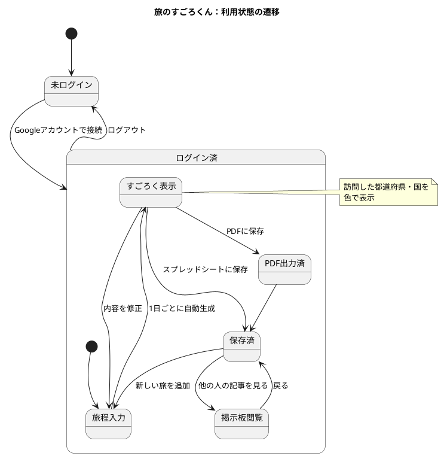
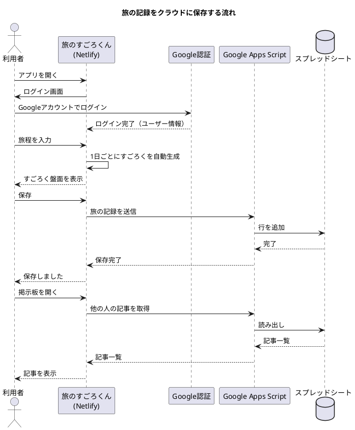
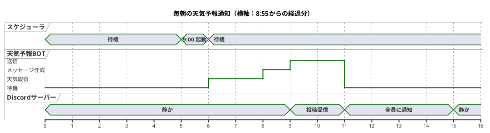

make a state, sequence and timing diagram.

# Q1 この画面について、１色覚(白黒）、２色覚、３色覚、４色覚における見え方に着目し、課題と助言を８項目、Wikipedia以外のURLをつけてお示しください。 https://researchmap.jp/blogs/blog_entries/view/1206201/8efa62d2c329734ede334e08555c3fbf?frame_id=2088191
A1 by Claude

ご指定のURLは、サイト側が自動アクセスを許可していないため、画面を開けませんでした。検索でも該当ページの内容は確認できませんでした。そのため、実際の配色やレイアウトを見たうえでの指摘はできません。以下は、researchmapのブログ記事ページに一般的に見られる要素（本文の文字、リンク、見出し、画像、表）を想定した課題と助言です。具体的な指摘をご希望でしたら、画面のスクリーンショットを貼ってください。

**1色覚（白黒。杆体1色覚など。明暗のみで見え、まぶしさや視力低下を伴うことがあります）**

1. **課題：明暗差が小さいと文字が読めません。** 灰色の文字や、薄い背景に薄い文字を使うと判読できなくなります。
 **助言：** 文字と背景のコントラスト比を4.5:1以上にしてください。まぶしさに配慮し、背景を真っ白にせず、ダークモードにも対応できると望ましいです。
 https://www.w3.org/WAI/WCAG22/Understanding/contrast-minimum.html

2. **課題：色だけで意味を区別している箇所は、白黒ではすべて同じ濃さに見えます。** 例として「赤字は重要」「青字はリンク」といった使い分けが挙げられます。
 **助言：** 下線、太字、記号、文言を併用してください。印刷や白黒表示でも意味が伝わるか確認すると確実です。
 https://www.w3.org/WAI/WCAG22/Understanding/use-of-color.html

**2色覚（P型・D型・T型。赤〜緑、または青〜黄の区別が難しくなります）**

3. **課題：赤と緑、茶と緑、ピンクと灰色が混同されます。** 色分けされたグラフや表の判読が難しくなります。
 **助言：** 色覚多様性に配慮した配色セットを使ってください。
 https://jfly.uni-koeln.de/colorset/

4. **課題：赤い文字は暗く沈んで見え、黒い文字との区別がつきにくくなります。** 特にP型では顕著です。
 **助言：** 強調には赤文字ではなく、太字や下線、背景色との組み合わせを使ってください。配色の設計指針は、NPO法人カラーユニバーサルデザイン機構のサイトで確認できます。
 https://www.cudo.jp/

**3色覚（一般色覚と、色弱の一部である異常3色覚）**

5. **課題：異常3色覚（C型・D型・P型の軽度から中等度）では、2色覚と似た混同が、程度は軽く起こります。** 淡い色同士の区別が難しく、薄い緑と黄、薄い赤とオレンジなどが混ざります。
 **助言：** 色の差だけで区別させず、明度差も付けてください。完成後は、シミュレーターで見え方を確認してください。
 https://developer.chrome.com/docs/devtools/rendering/emulate-vision-deficiencies

6. **課題：一般色覚でも、画面の設定や環境光で色が変わって見えます。** 青い下線付きリンクが薄い背景色に埋もれることがあります。
 **助言：** リンクには色だけでなく下線を付け、本文との明度差も確保してください。
 https://www.w3.org/TR/WCAG22/

**4色覚（第4の錐体を持つ人。ごく少数で、主に色覚保因者の女性に報告があります）**

7. **課題：RGBの3原色で作られる画面では、4色覚の人が持つ色の識別力をそもそも再現できません。** 個人差が大きく、見え方を一般化することも難しい状況です。
 **助言：** 4色覚だけを対象にした設計はできません。「微妙な色の差に意味を持たせない」ことが現実的な対応です。色覚の種類を問わず使える設計にしてください。
 https://www.nei.nih.gov/learn-about-eye-health/eye-conditions-and-diseases/color-blindness

**全タイプ共通**

8. **課題：画像内の文字、グラフ、写真に代替テキストがない場合、見え方の違いによらず情報が失われます。** 凡例が色だけの図も同様です。
 **助言：** 画像には代替テキストを付け、グラフの系列には直接ラベルを書くか、線種やマーカーの形を変えてください。日本の基準は、ウェブアクセシビリティ基盤委員会（JIS X 8341-3）で確認できます。
 https://waic.jp/

画面を確認できれば、色の組み合わせやコントラスト比を具体的に指摘できます。

# Q2 tabi.png

よろしくお願いします
A2 

スライドを拝見しました。実際に色覚シミュレーターで検証したわけではなく、画面の配色と文字の大きさから見立てた内容です。画面の主な弱点は、LINEのメニュー6色タイルの白文字、Discordの小さな文字、そしてスライド全体の文字サイズです。

**1色覚（白黒。明暗だけで見え、まぶしさや視力低下を伴うことがあります）**

1. **課題：LINEのタイルは、白黒にすると明るさがほぼ同じ中間グレーになり、区別しにくくなります。** 赤（場所）、オレンジ、青緑（時間）は明度が近く、特に黄色（天気）の白文字は、白黒ではほとんど見えなくなります。コントラスト比は約1.5:1程度と推定され、基準の4.5:1に届いていません。
 **助言：** 黄色タイルは黒や濃紺の文字に変えてください。他のタイルも、濃い色に白文字、薄い色に黒文字という形で明度を揃えて分けてください。
 https://webaim.org/resources/contrastchecker/

2. **課題：Discordのダーク画面は、まぶしさには優しい一方で、グレーの小さな文字が暗い背景に沈んでいます。** 2つの画面は同じ形式で、内容は昨日と今日の天気です。
 **助言：** 都市名は太字にして、天気の説明文は白に近い色にしてください。画面の一部を拡大して見せる手もあります。
 https://www.w3.org/WAI/WCAG22/Understanding/contrast-minimum.html

**2色覚（P型・D型・T型。赤〜緑、または青〜黄の区別が難しくなります）**

3. **課題：赤（場所）、オレンジ、青緑（時間）、黄色（天気）の4タイルは、P型・D型では茶色や黄土色に寄って、互いに似て見えます。** 現状は「場所」「天気」などの文字ラベルが区別の手がかりになっていますが、ラベル自体が小さく、白文字で見づらくなっています。
 **助言：** 色に頼らず、アイコンや大きな文字でタイルを区別してください。色を残す場合は、色覚多様性に配慮した配色セットを使ってください。
 https://jfly.uni-koeln.de/colorset/

4. **課題：オレンジのタイルにある手書き風の青い「Discord」は、線が細く、オレンジ地との明度差も小さいため、読みにくくなります。** 青とオレンジは2色覚でも区別できる組み合わせですが、細い線だとその利点が生きません。
 **助言：** 太い文字にするか、白い縁取りを付けてください。そもそも装飾的な手書き文字は、情報の主役にしない方が安全です。
 https://www.cudo.jp/

**3色覚（一般色覚と、色弱の一部である異常3色覚）**

5. **課題：Discordの天気絵文字は、色の違いを手がかりにしにくい組み合わせです。** ⚡（雷）と☀（晴れ）はどちらも黄色系、☁と🌧はどちらも青灰色系で、異常3色覚では色の違いが小さくなります。
 **助言：** 絵文字の形は違うので、都市名と天気の文字をセットで必ず併記する現在の方式を維持してください。文字の併記があるのは良い点です。
 https://www.w3.org/WAI/WCAG22/Understanding/use-of-color.html

6. **課題：見出しの緑（制作物のご紹介①）と本文の紺は、どちらも暗い色で似た明度のため、強調の差が出にくくなっています。** サブタイトル「旅程プランナーアプリ」は薄いグレーの小さな文字で、読みにくくなります。
 **助言：** 階層は色ではなく、文字サイズと太さで付けてください。サブタイトルは濃いグレーに変更してください。
 https://www.w3.org/TR/WCAG22/

**4色覚（第4の錐体を持つ人。ごく少数で、主に色覚保因者の女性に報告があります）**

7. **課題：4色覚の人が識別できる微妙な色差は、RGBの画面や投影では再現できず、見え方の個人差も大きくなります。** このスライドのように色数が多いと、人によって「どれが同系色か」の感じ方が変わります。
 **助言：** 微妙な色の差に意味を持たせず、色数を絞ってください。たとえばLINEのタイルは、色相を6つ使わず2〜3色にし、残りは文字やアイコンで区別すると、どの見え方でも安定します。
 https://www.nei.nih.gov/learn-about-eye-health/eye-conditions-and-diseases/color-blindness

**全タイプ共通**

8. **課題：スクリーンショットが3枚並ぶ構成で、スライド全体の文字が小さく、会場のプロジェクターや後方席では判読できなくなります。** 色覚特性に関係なく、情報が届かない恐れがあります。
 **助言：** 各画面の要点を1つに絞り、拡大して見せてください。完成後は、PCのシミュレーション機能で、各色覚タイプの見え方を確認してください。
 https://colororacle.org/

優先順位をつけるなら、まず2つの修正が効果的です。LINEタイルの文字色の見直し（1・3）と、スライド全体の文字サイズの拡大（8）です。

# Q3 資料の全16枚を読み、中心になる処理を3つ選びました。図の流れはスライドの記述から組み立てたものです。細部（画面名やBOTの内部動作など）は私の推測を含むので、実際の実装に合わせて調整してください。

## 1. 状態遷移図：旅のすごろくんの利用状態
スライド5〜6の「Googleログイン→すごろく自動生成→保存・PDF化」を状態にしました。

## 2. 時系列図（シーケンス図）：ログインから保存まで
スライド6・9の「Googleログイン、Google Apps Script、スプレッドシートに保存」の流れです。

## 3. 刻時図（タイミング図）：Discord BOTの毎朝の天気通知
スライド7の「毎朝9時ごろに全国の天気予報が届く」を、時間軸で表しました。横軸は、8:55を0とした経過分です。

## 描画方法
各コードを https://www.plantuml.com/plantuml/ に貼り付けると描画できます。VS CodeのPlantUML拡張機能でも描画できます。

ほかに「おもいでアルバム」の図も作れます。たとえば思い出カードの状態遷移（記録→カテゴリ分け→めくる閲覧→PDF書き出し）などです。
