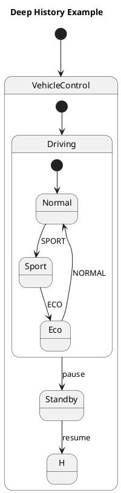

# Q1 UMLで深い履歴疑似状態 ってなんですか。
A1 by chatGPT

UMLの**深い履歴疑似状態（Deep History Pseudostate）**は、状態機械図で、

> **いったん複合状態から外に出たあと、戻ってきたときに「以前の内部状態を階層の深いところまで復元する」**

ために使います。

特に、**階層化された状態機械**で役立ちます。

---

## 1. まず「履歴」がなぜ必要か

例えば自動車の制御を、

```text
VehicleControl
 ├─ Driving
 │   ├─ Normal
 │   └─ Sport
 └─ Standby
```

とします。

現在、

```text
VehicleControl
    ↓
Driving
    ↓
Sport
```

だったとします。

ここで一時的に `Standby` に移った後、

```text
Standby
   ↓
VehicleControl
```

と戻ってきたとき、

> 「さっきまで `Driving → Sport` だった」

という状態を復元したいことがあります。

このために**History**を使います。

---

# 2. Shallow Historyとの違い

ここが「深い履歴」のポイントです。

例えば、

```text
VehicleControl
 └─ Driving
     └─ Sport
```

という階層だったとします。

### Shallow History（浅い履歴）

直下の状態だけを記憶します。

```text
VehicleControl
    ↓
Driving
```

までは復元しますが、その下の

```text
Sport
```

まで復元するとは限りません。

---

### Deep History（深い履歴）

階層を下までたどって、

```text
VehicleControl
    ↓
Driving
    ↓
Sport
```

という**最も深い状態まで復元**します。

---

# 3. PlantUMLで表すと

例えば、



ここで、

```text
H <<deepHistory>>
```

が**深い履歴疑似状態**です。

イメージとしては、

```text
          VehicleControl
                │
         ┌──────┴──────┐
         │             │
      Driving        Standby
         │
    ┌────┼────┐
 Normal Sport  Eco
```

で、現在

```text
Driving → Sport
```

だったところから `Standby` に移り、

```text
Standby
   ↓
Deep History
```

で戻ると、

```text
Driving → Sport
```

まで復元します。

---

# 4. ShallowとDeepを比較

非常に重要なので、図にすると、

```text
現在：

VehicleControl
    │
    └─ Driving
         │
         └─ Sport
```

一旦外へ出る。

```text
VehicleControl

          ↓

       Standby
```

そして戻る。

### Shallow History

```text
VehicleControl
    │
    └─ Driving
```

まで。

### Deep History

```text
VehicleControl
    │
    └─ Driving
         │
         └─ Sport
```

まで。

つまり、

> **Shallow = 1階層だけ覚える**  
> **Deep = 内部の階層を含めて覚える**

と理解するとよいです。

---

# 5. 組込みシステムではかなり使える

例えば車載ECUの動作モードを、

```text
Vehicle
 ├─ Drive
 │   ├─ Normal
 │   ├─ Eco
 │   └─ Sport
 │
 ├─ Charging
 │   ├─ Fast
 │   └─ Normal
 │
 └─ Sleep
```

とします。

`Sport`で走行していたところ、

```text
Drive → Sleep
```

になり、復帰したとき、

```text
Sleep
 ↓
Deep History
 ↓
Drive
 ↓
Sport
```

と復元できる、というモデルが考えられます。

ただし、**安全系では「以前の状態をそのまま復元してよいか」を慎重に考える必要があります。**

例えば、

```text
OverTemperature
     ↓
Emergency
     ↓
PowerOff
```

となった後に、Deep Historyで以前の `Driving/Sport` に自動復帰させるのは危険です。

したがってDeep Historyは、

> **「状態を覚えておけば便利」なところに使う**

のであって、

> **「異常から自動復帰する仕組み」**

として安易に使うものではありません。

---

## 6. 小川さんの「状態遷移→RTL」の観点では

Deep HistoryをRTLに落とす場合は、

```text
現在状態
   ↓
階層状態を保存
   ↓
一時状態へ
   ↓
復帰
   ↓
保存していた階層状態を復元
```

となるため、**単なる1ビットの状態記憶ではなく、複数階層の状態を保持するレジスタが必要**になります。

そのため、Deep Historyは、

**UML上では簡単に見えるが、RTL実装では意外と面白い題材**

です。

例えば学生に、

> 「Deep Historyを使ったUML状態機械をVerilogに変換せよ」

という課題を出すと、**階層状態、状態保存、復元、リセット、異常復帰**まで考えさせることができます。これは小川さんが以前検討されていた「状態遷移図からVerilog生成」にもかなり相性がいいテーマです。
