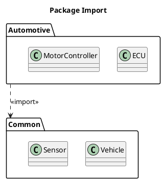
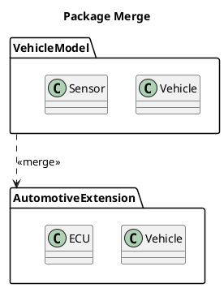
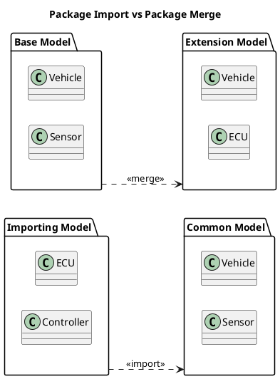

# Q1 UMLでパッケージ改装 ってどいういう時に使いますか。
A1 by chatgpt

「パッケージ改装」は、おそらくUMLの **Package Merge（パッケージ・マージ）** のことだと思います。  
もし「改装」が別の用語の訳でしたら、元の英語を教えてください。

### Package Mergeとは

UMLのパッケージ同士を**統合して、あるパッケージの内容を別のパッケージに取り込む**ための仕組みです。

イメージは、

```text
       <<merge>>
Package A ---------> Package B
```

で、**Aの定義をBの名前空間に取り込んだとき、既存の定義とどう統合するか**を指定します。

単純な「import」とは違います。

|  | Package Import | Package Merge |
|---|---|---|
| 意味 | 他の要素を参照可能にする | 定義を統合する |
| 元の要素 | 基本的にそのまま | 拡張・統合される |
| 用途 | 要素を利用したい | モデルを組み合わせたい |
| 典型例 | ライブラリ利用 | 標準モデルの拡張 |

### 例えばUMLモデルを拡張する場合

例えば基本となるモデルを

```text
UML_Base
 ├─ Vehicle
 ├─ Engine
 └─ Sensor
```

として、別のパッケージで自動車向けに拡張します。

```text
Automotive
 ├─ Engine
 ├─ CAN
 └─ ECU
```

ここでPackage Mergeを使って、

```text
UML_Base
       \
        >---- AutomotiveModel
       /
Automotive
```

のように、**既存モデルの定義を土台にして別のモデルを統合する**ことができます。

### 小川さんのAUTOSARで考えると

これはかなり面白い使い方があります。

例えば、

```text
       AUTOSAR_Core
             |
         <<merge>>
             |
     AUTOSAR_Automotive
```

のように、

- 共通のモデル
- AUTOSAR固有の拡張
- ECU固有の拡張

を段階的に構成する考え方です。

特にUMLの仕様そのものが、**メタモデルをパッケージに分割し、それらをPackage Mergeで組み合わせる**という構造を採っています。

したがってPackage Mergeは、普通のプログラム開発で毎日のように使う図というより、

> **大規模なUMLモデルを、共通部分＋専門分野の拡張部分に分割して管理するとき**

に威力を発揮する機能、と考えると分かりやすいです。

なお、**Package ImportとPackage Mergeを混同しやすい**ので、次にこの2つをPlantUMLで並べてみるとかなり理解しやすくなります。

# q2 Package ImportとPackage Mergeを混同しやすいので、次にこの2つをPlantUMLで並べてみる
A2 

はい。ここは**「参照する」のか「モデルを統合する」のか**で分けると理解しやすいです。  
PlantUMLで並べると、次のようになります。

## 1. Package Import ― 「中身を使えるようにする」



概念的には、

```text
Common
 ├─ Vehicle
 └─ Sensor
       ↑
       │ import
       │
Automotive
 ├─ ECU
 └─ MotorController
```

です。

**AutomotiveパッケージからCommonの要素を参照・利用できるようにする**のが目的です。

例えば、

```text
Automotive::ECU
        ↓
Common::Sensor
```

のように、`Sensor`を利用できます。

重要なのは、

> **Commonそのものを書き換えたり、Automotiveと一体化した新しい定義を作ったりするわけではない**

ということです。

---

# 2. Package Merge ― 「モデルを統合する」



こちらは単純な参照ではありません。

例えば、

```text
VehicleModel
 ├─ Vehicle
 └─ Sensor

       ↓ merge

AutomotiveExtension
 ├─ Vehicle
 └─ ECU
```

のように、**同じ名前のモデル要素が存在する場合、それらを統合してより具体的なモデルを構成する**ことができます。

概念的には、

```text
Vehicle
   │
   ├── 共通の定義
   │
   └── Automotive側の追加・変更
             ↓
        統合されたVehicle
```

というイメージです。

---

# 3. 2つを横に並べる

一番分かりやすい比較はこれです。



ただし、**Package Mergeの矢印の向きは資料によって非常に混乱しやすい**ので、UML仕様上の表記を確認する際には注意してください。

---

## 4. 一言で区別すると

私は学生には次のように説明すると分かりやすいと思います。

> **Import = 「借りて使う」**  
> **Merge = 「取り込んで一つのモデルとして構成する」**

さらにプログラミングに対応させるなら、

```text
Package Import
    ≒
ライブラリを利用する

Package Merge
    ≒
共通モデル＋拡張モデルから
一つのモデルを構成する
```

と考えるとよいでしょう。

### 5. AUTOSARで考えると

小川さんの関心に近い例なら、

```text
                Common
                  │
                import
                  ↓
             AUTOSAR App
```

なら、

**「共通モデルをAUTOSARモデルから利用する」**

です。

一方、

```text
        AUTOSAR Common Model
                │
              merge
                ↓
       AUTOSAR Automotive Model
                │
              merge
                ↓
           OEM Model
```

なら、

**「共通モデル → AUTOSAR固有モデル → OEM固有モデル」**

というように、段階的にモデルを拡張・統合する構造を表現できます。

この **「共通 → 標準 → 業界 → 企業 → 製品」**という階層は、UMLのPackage Mergeを理解するうえでかなり良い教材になります。


