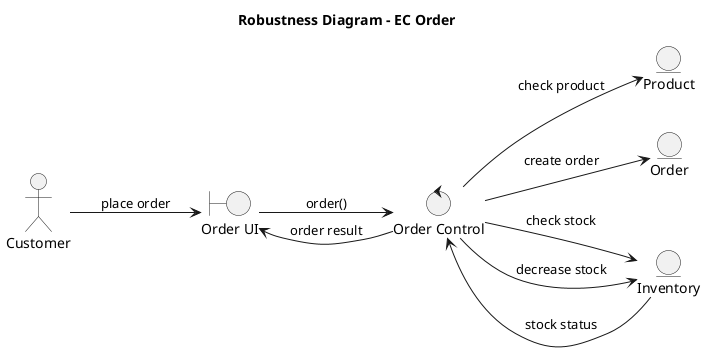
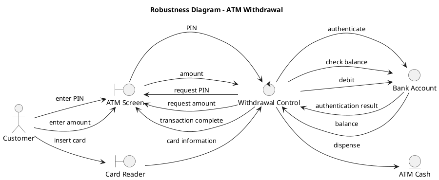
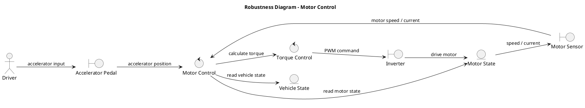
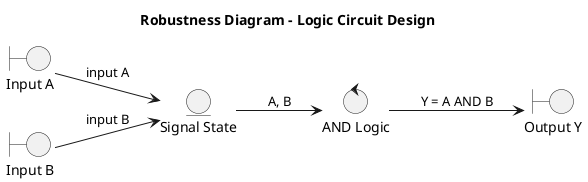
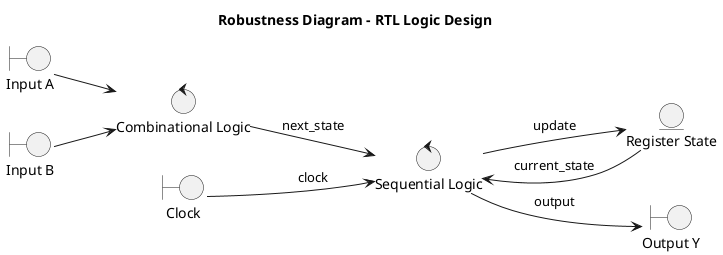

# Q1 UML関連でロバストネスってなんの役にたつのですか。
A1 by chatGPT

はい。UML関連でいう**ロバストネス（Robustness）**は、かなり実務的には、

> **「要求仕様で書かれたこと」を「実際にソフトウェアとして実現できる構造」へ橋渡しする**

のに役立ちます。

特に小川さんが重視されている**状態遷移・シーケンス・C/C++/組込みソフトウェア**との相性がよい概念です。

### 1. ロバストネス図とは

代表的には、UMLのユースケースを分析するときに、次の3種類の要素を使います。

| 種類 | 意味 | 例 |
|---|---|---|
| **Boundary** | 外部との境界 | 画面、CAN通信、センサI/F |
| **Control** | 処理・制御 | 制御ロジック、ユースケース処理 |
| **Entity** | 情報・対象 | 車両状態、注文、設定値 |

例えば自動車の「ブレーキ要求」を考えると、

```text
[Brake Pedal]
      |
      | Boundary
      v
+----------------+
| BrakeControl   |  Control
+----------------+
      |
      v
[VehicleState]       Entity
      |
      v
[Brake Actuator]     Boundary
```

のように、**「誰が何をするのか」**を整理できます。

---

### 2. 何が嬉しいのか

一番大きいのは、**いきなりクラス設計に飛び込まなくてよい**ことです。

例えば要求仕様に、

> 運転者がブレーキを踏むと、ブレーキ制御を開始し、車両状態に応じて制動力を調整する。

と書かれていたとします。

いきなり、

```text
class BrakeController
class VehicleState
class BrakeActuator
```

と考えると、設計者の思い込みが入りやすい。

ロバストネス分析なら、

```text
運転者
  ↓
Boundary
  ↓
Control
  ↓
Entity
  ↓
Boundary
```

という**責務の流れ**を先に確認できます。

---

### 3. シーケンス図への橋渡しになる

ここが小川さんのUML教育では特に使いやすいところだと思います。

例えば、

```text
      Boundary       Control        Entity
          |             |             |
          | brake()     |             |
          |------------>|             |
          |             | getState()  |
          |             |------------>|
          |             |<------------|
          |             | control()   |
          |             |------------->
```

というロバストネス分析を行った後、

**シーケンス図**

↓

**クラス図**

↓

**C/C++実装**

へ展開できます。

つまり、

```text
要求
 ↓
ユースケース
 ↓
ロバストネス分析
 ↓
シーケンス図
 ↓
クラス設計
 ↓
プログラム
```

という流れを作れます。

---

### 4. 「Control」を入れるのが重要

ロバストネスの面白いところは、**BoundaryとEntityだけではなく、その間にControlを置く**ことです。

例えば、

```text
Sensor ──→ SensorControl ──→ VehicleState
```

とすると、

- Sensor：入力を提供する
- SensorControl：入力を処理する
- VehicleState：状態を保持する

という**責務分担**が見えてきます。

これは組込みでは非常に重要です。

例えば、

```text
CAN受信
   ↓
CAN Driver
   ↓
CAN Message Handler
   ↓
Vehicle State
   ↓
Control Algorithm
   ↓
Actuator
```

という構造にも対応させやすい。

---

### 5. ただし「ロバストネス＝ソフトウェアの堅牢性」ではない

ここは名前が少し紛らわしいです。

UMLでいう **Robustness Analysis** の「Robustness」は、

> **障害に強い・壊れにくいソフトウェア**

という意味の「robustness」とは少し違います。

むしろ、

> **要求と設計の間にある分析モデル**

と理解した方がよいです。

---

### 6. 小川さんの教育なら、かなり使い道があります

例えば20日間のUML＋構造化プログラミング教育なら、

```text
Day 1～        要求・ユースケース
       ↓
               Robustness
       ↓
               Sequence
       ↓
               State Machine
       ↓
               Class
       ↓
               C/Python/Rust
```

という流れにすると、**「なぜクラスが必要なのか」**を学生に説明しやすくなります。

特に、

**「ユースケース → ロバストネス → シーケンス → 状態機械 → クラス → コード」**

という流れは、単にUMLの図を覚えさせるよりも、**要求から実装までの論理的な変換過程**を教える教材として使えます。

そして小川さんが重視されている**タイミング**を考えるなら、ロバストネス図だけで終わらせず、そこから**シーケンス図＋タイミング図＋状態機械図**へ展開するのが特に面白いと思います。

# Q2 PlantUMLでロバストネス図を４つ書いてください。そのうち一つは、論理回路設計の例でお願いします。
A2

もちろんです。PlantUMLでは、ロバストネス図を**Boundary / Control / Entity**の3種類に分けて表現すると分かりやすいです。

以下の4例にしました。

1. ECサイトの注文
2. ATMの現金引き出し
3. 自動車のモータ制御
4. **論理回路設計** — HDL設計を意識した例

特に4番目は、通常の業務システムのロバストネス分析を**論理回路・RTL設計へ応用する**形にしています。

---

## 1. ECサイトの注文




ここでは、

```text
Customer
    ↓
Boundary
    ↓
Control
    ↓
Entity
```

という基本構造が見えます。

---

## 2. ATMの現金引き出し




この例では、**BoundaryとEntityの間にControlを置くことで、処理責務が明確になる**のがポイントです。

---

# 3. 自動車のモータ制御

これは組込み系なので、ロバストネス分析との相性がかなり良い例です。




この場合、

| 種類 | 要素 |
|---|---|
| Boundary | アクセル、モータセンサ、インバータ |
| Control | Motor Control、Torque Control |
| Entity | Vehicle State、Motor State |

となります。

ここから、

**Robustness → Sequence → State Machine → Timing → C/C++**

という流れに発展させることができます。

---

# 4. 論理回路設計

ここが少し変わった応用例です。

例えば、

> 2つの入力 `A`, `B` があり、両方が1のとき出力 `Y` を1にする。

つまりAND回路です。

```text
Y = A AND B
```

これをロバストネス的に表現すると、




ただし、論理回路設計では、もう少しRTL設計に近づけることもできます。

例えば、

```text
入力
 ↓
組合せ論理
 ↓
レジスタ
 ↓
出力
```

という回路なら、



となります。

---

## ただし、論理回路では少し注意が必要です

ここは重要です。

**UMLのロバストネス図を、そのまま論理回路設計図として使うわけではありません。**

むしろ、

```text
要求
 ↓
Use Case
 ↓
Robustness
 ↓
状態・データ・信号の整理
 ↓
State Machine
 ↓
Timing Diagram
 ↓
RTL
 ↓
Verilog / VHDL
```

という**上流設計の整理手段**として使うのが面白いと思います。

特に小川さんが以前検討されていた

> **状態遷移図からVerilogを生成する**

という方向なら、ロバストネス図をその前段に置いて、

```text
Boundary
   ↓
Control
   ↓
Entity
   ↓
State Machine
   ↓
Timing
   ↓
Verilog
```

という変換パイプラインを作ることができます。

この考え方だと、**「論理回路の機能要求 → UML → RTL」**という、かなり面白い研究テーマにもできます。
