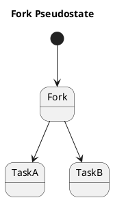
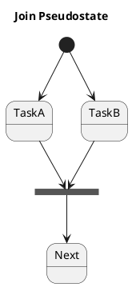
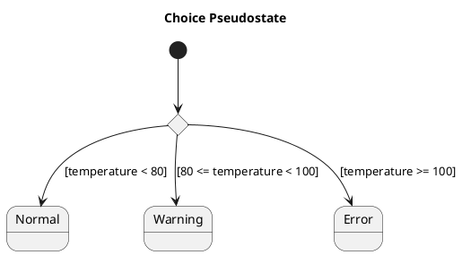
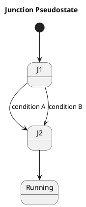
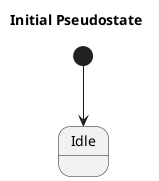
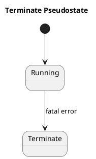
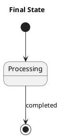
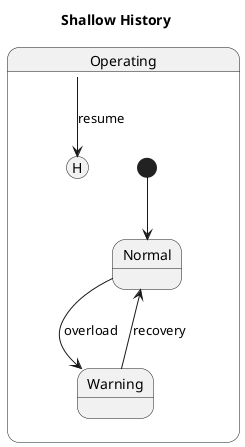
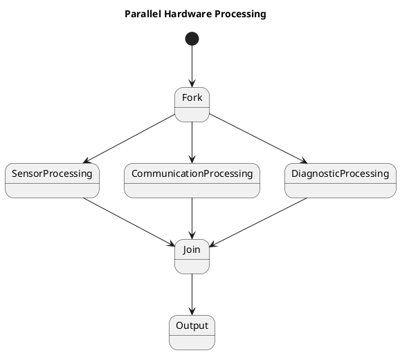

# Q1 UMLのフォーク疑似状態  を、他の疑似状態とともにPlantUMLで説明してください。
A1 by chatgpt 

はい。UMLの**フォーク（Fork）疑似状態**は、特に状態機械図で重要です。  
「1本の制御の流れを、複数の並行する状態へ分岐させる」ために使います。

ただし、**ForkとChoice（選択）を混同しない**ことが重要です。

以下、代表的な疑似状態をPlantUMLでまとめます。

---

# 1. Fork（フォーク）

Forkは、

> **1本の遷移を複数の並行する遷移に分ける**

ために使います。



概念的には、

```text
             ┌──→ TaskA
             │
Start ──→ Fork
             │
             └──→ TaskB
```

です。

ここで重要なのは、**TaskAとTaskBのどちらかを選ぶのではありません。**

**両方が並行して開始されます。**

---

# 2. Join（ジョイン）

Forkの反対側にある重要な疑似状態が**Join**です。

複数の並行処理が完了するのを待って、1本にまとめます。



イメージは、

```text
        ┌──→ TaskA ──┐
Start ──┤             ├──→ Join ──→ Next
        └──→ TaskB ──┘
```

です。

したがって、

```text
Fork
  ↓
並行処理
  ↓
Join
```

という組み合わせが非常によく使われます。

---

# 3. Choice（選択）

**Choice**はForkとは全く違います。

Choiceは、

> **条件によって、複数の遷移のうち1つを選択する**

ものです。



つまり、

```text
              ┌──→ Normal
              │
Input → Choice ┼──→ Warning
              │
              └──→ Error
```

ですが、**3つ全部には行きません。**

条件を満たす**1つの経路**に進みます。

---

# 4. Junction（ジャンクション）

Junctionは、複数の遷移を**接続・整理するための疑似状態**です。

例えば、



複雑な状態遷移を、

```text
A ──┐
    ├──→ J2 ──→ Running
B ──┘
```

のように整理できます。

**Choiceが「選択」なのに対して、Junctionは「遷移をつなぐ」ことが主目的**です。

---

# 5. Initial（初期疑似状態）

状態機械を開始するときの入口です。

PlantUMLでは、



の

```text
[*]
```

が初期疑似状態に対応します。

```text
● ──→ Idle
```

---

# 6. Terminate（終了疑似状態）

Terminateは、**状態機械の実行を終了させる**ための疑似状態です。

PlantUMLでは `<<terminate>>` を利用できます。



概念的には、

```text
Running
   │
   │ fatal error
   ↓
   ◎
Terminate
```

です。

**Final State**とは意味が違います。

---

# 7. Final State（終了状態）

Final Stateは、その**領域（Region）で状態機械の処理が終了した**ことを表します。



```text
● → Processing → ◎
```

という形です。

---

# 8. Shallow History / Deep History

もう一つ、状態機械で重要なのが**History**です。

例えば、

```text
Operating
 ├─ Normal
 └─ Warning
```

という複合状態から一度離れて、あとで戻る場合、

> 「以前どの状態にいたか」を記憶しておく

ためにHistoryを使います。

Shallow History：



**Shallow History**は、直接下の階層の状態を記憶します。

一方、

**Deep History**は、さらに内部の階層まで記憶します。

---

# 9. Fork / Join / Choiceを比較すると

ここが一番重要です。

| 疑似状態 | 目的 | 結果 |
|---|---|---|
| **Initial** | 開始 | 1つの状態へ |
| **Fork** | 並行化 | **複数へ同時に分岐** |
| **Join** | 同期 | **複数から1つへ** |
| **Choice** | 条件選択 | **複数から1つを選択** |
| **Junction** | 遷移接続 | 遷移を整理 |
| **History** | 過去状態の復元 | 以前の状態へ |
| **Terminate** | 実行終了 | 状態機械を終了 |
| **Final** | 領域の終了 | 完了状態 |

特に、

```text
Fork       Choice
  │           │
  ├── A       ├── A
  └── B       └── B
```

を見比べると分かりやすいです。

**Fork：AとBの両方**

**Choice：AかBのどちらか**

です。

---

## 10. 組込み・論理回路ならForkが特に面白い

小川さんが以前の**論理回路設計＋UML**の演習を発展させるなら、例えば、



とできます。

これは、

```text
             ┌→ Sensor Processing ─┐
             │                     │
Input → Fork ├→ Communication ─────┼→ Join → Output
             │                     │
             └→ Diagnostic ───────┘
```

という構造です。

ここからさらに**Timing Diagram**を追加すると、

```text
Fork
 ↓
┌──────────────┐
│ Sensor       │
│ Communication│  ← 並列
│ Diagnostic   │
└──────────────┘
 ↓
Join
 ↓
Output
```

という、**UMLの状態機械 → 並行処理 → タイミング → RTL設計**への橋渡しができます。

なお、UML仕様上では **Fork/Join、Choice/Junction、Initial/Final/Terminate、History** はそれぞれ意味が異なるため、教材では「分岐」という一語でまとめず、**「並行化」「同期」「選択」「接続」「開始」「終了」「履歴」**と役割を分けて教えるのがおすすめです。
